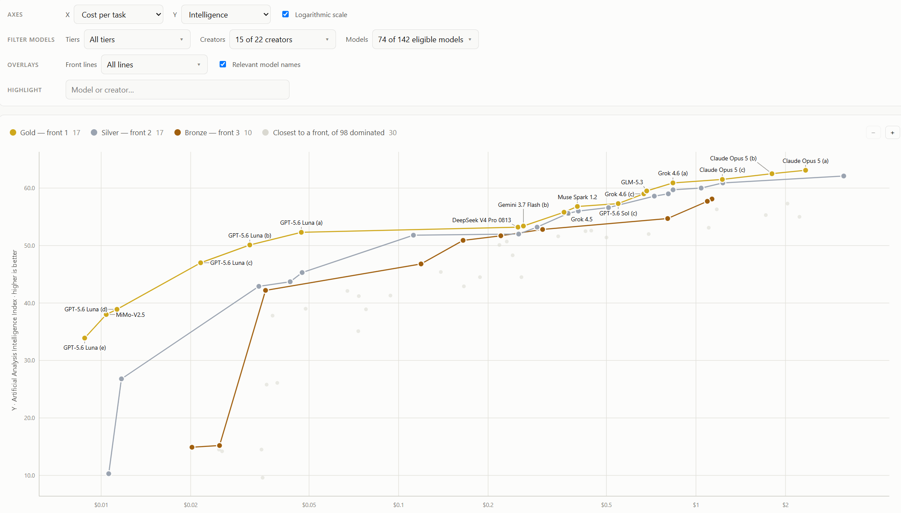
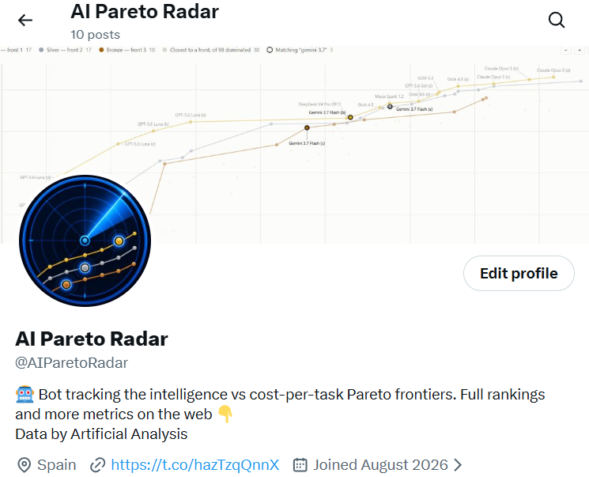
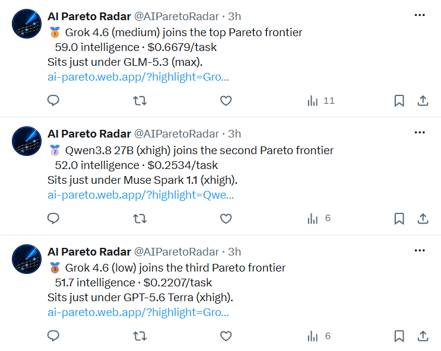
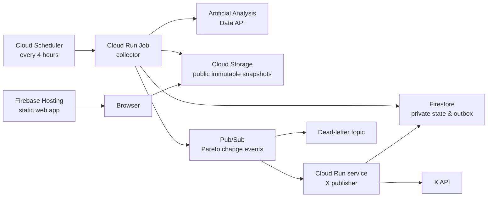
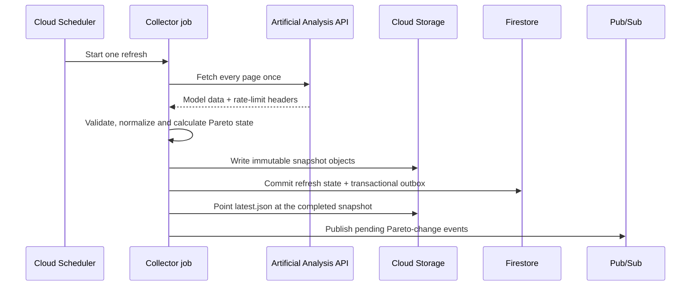
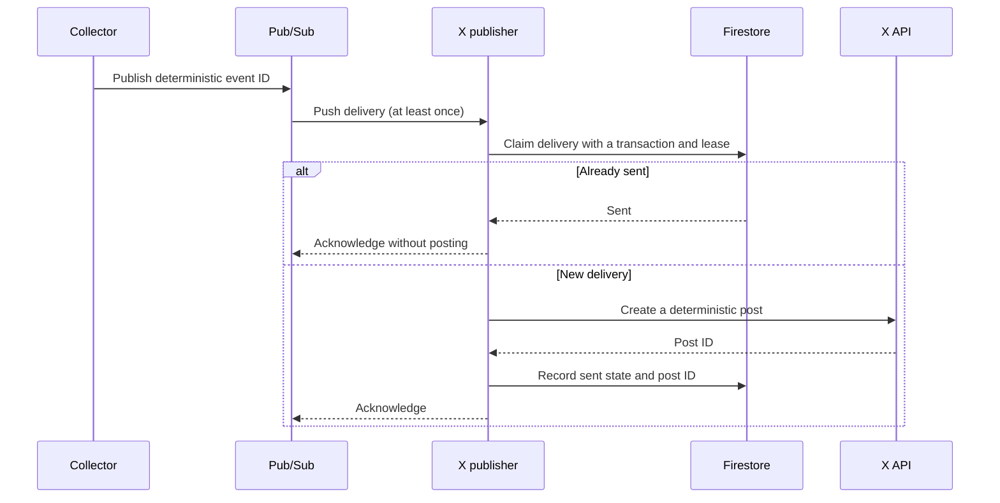

<p align="center">
  
</p>

<h1 align="center">AI Pareto</h1>

<p align="center">
  <strong>Explore the trade-offs between the world's leading AI models — and get pinged when the frontier moves.</strong>
</p>

<p align="center">
  <a href="https://ai-pareto.web.app"><strong>Open the live app</strong></a>
  ·
  <a href="https://x.com/AIParetoRadar"><strong>Follow @AIParetoRadar on X</strong></a>
  ·
  <a href="doc/architecture.md">Architecture</a>
  ·
  <a href="CHANGELOG.md">Changelog</a>
  ·
  <a href="doc/local-development.md">Local development</a>
</p>

---

There is no single "best" AI model — only trade-offs. A model that tops the intelligence charts can cost fifty times more per task than one a few points behind it. AI Pareto turns the [Artificial Analysis](https://artificialanalysis.ai) dataset into the picture that makes those trade-offs visible: the **Pareto frontier** — the set of models nothing else beats on both of the metrics you care about.

The project is two products running on one production pipeline:

- **The web app** — an interactive Pareto frontier explorer, live at [ai-pareto.web.app](https://ai-pareto.web.app) and refreshed every four hours.
- **AI Pareto Radar** — an X bot watching the same frontier, posting whenever a model joins it or climbs it: [@AIParetoRadar](https://x.com/AIParetoRadar).

## The web app

[](https://ai-pareto.web.app)

Pick any two of **intelligence, price per million tokens, cost per benchmark task, generation speed, and time to first token**, and the chart draws the first three Pareto fronts as gold, silver, and bronze tiers — with the thirty models closest to joining a front kept behind them as context, so the frontier is read against the field it beats.

Around that core:

- **Search and highlight** models or creators without making the frontier disappear — everything else dims, matches are named first.
- **Filter at the right layer**: model and creator pickers recompute the frontier for the exact set you select; tier and front-line toggles only change what is drawn, preserving what the medals mean.
- **Zoom into the crowded corners** — pinch on touch, Ctrl/⌘ + wheel on desktop. The zoom is a view, never a filter: fronts, legend, and table ignore it.
- **Readable labels, by design**: names use collision-aware placement that never covers a frontier, and model variants collapse to letters — `Claude Opus 5 (a)` is the ablest of its family — so a phone can name the whole gold front.
- **An accessible table view** carries the same ranked data as the chart, for readers and screen readers alike.
- **Deep links**: every bot post lands on `?highlight=<model>`, opening the chart with that model already highlighted.

The layout is phone-first where it counts: filters fold away so the plot gets the pixels, the chart/table switch stays one tap away, and small screens open on the gold front alone with its models named.

## The Radar bot

While the app answers "which model should I pick today?", the bot answers "did the answer just change?". After every data refresh it compares the new cost-per-task × intelligence frontier against the last one and posts each **arrival** (a model joining a front) and **promotion** (a model moving up to a better one).

<table>
  <tr>
    <td width="50%"></td>
    <td width="50%"></td>
  </tr>
</table>

The posting rules were tuned against real frontier movements, not hypothetical ones:

- **Only arrivals and promotions.** One arrival can cascade into many demotions; announcing each would retell the same news five times. Demotions and exits stay silent.
- **One post per movement**, with the medal, the model's metrics, and its nearest frontier neighbour — and a link that opens the chart with the model highlighted.
- **Duplicate-safe by construction.** Cloud delivery is at-least-once, so the bot is built to make retries harmless rather than pretending they will not happen (details below).

## Pareto tiers, not a winner-takes-all score

A model is on the first frontier when no other measured model beats it on both selected axes. Remove that frontier and the next best set becomes the second; repeat once more for bronze. Front rank is invariant to units and to the log/linear toggle — unlike any weighted score or efficiency ratio, both of which were considered and rejected.

For affordability, the project deliberately exposes two different measures:

| Metric | Meaning | Why it matters |
| --- | --- | --- |
| Price per 1M tokens | 3:1 blended input/output token rate | A **rate** — useful for comparing API prices; broader data coverage. |
| Cost per task | Actual spend per Artificial Analysis Intelligence Index task | A **bill** — it prices verbosity too, so a chatty reasoning model can be cheap per token and expensive per task. |

Missing values are excluded from the relevant axis. In particular, an upstream price of `$0` for an open-weight model without a hosted priced endpoint is treated as missing, so it cannot incorrectly dominate every cost comparison.

## Architecture

The production design separates public reads, scheduled ingestion, state, and external side effects. Static content does the everyday work; compute runs only when a refresh or an event needs it, and every workload scales to zero between runs.



### Data refresh lifecycle



`latest.json` is updated only after the immutable snapshot has been written successfully. Browsers therefore read one coherent dataset, while older snapshots stay cacheable and can be retained independently.

### Event delivery and duplicate safety



Cloud delivery is intentionally treated as at-least-once. A transactional outbox prevents a refresh from losing its change event, Firestore leases prevent concurrent processing, and a recent-timeline reconciliation check narrows the remaining external-API failure window. The design does not make an unjustified "exactly once" claim where the X API cannot offer an idempotency key.

## Technology

| Area | Technology | How it is used |
| --- | --- | --- |
| Frontend | HTML, CSS, ES modules, SVG | Dependency-free responsive scatter plot, controls, tooltip, and table. |
| Local API | Node.js 22 standard library | Keeps the Artificial Analysis key server-side and serves the web app from the same origin. |
| Data pipeline | Node.js, Google Auth Library, Firestore, Pub/Sub | Normalizes paginated source data, creates snapshots, detects meaningful frontier movements, and publishes domain events. |
| Cloud platform | Google Cloud Run, Cloud Scheduler, Cloud Storage, Firestore, Pub/Sub, Secret Manager | Scale-to-zero workloads, scheduled refreshes, immutable public data, private state, messaging, and secrets. |
| Hosting | Firebase Hosting | CDN-backed static delivery of the frontend. |
| Infrastructure | Terraform, Cloud Build, Artifact Registry | Reproducible cloud resources and digest-pinned container deployments. |
| Notifications | X API with OAuth 1.0a User Context | A private Pub/Sub push consumer renders and publishes changes to the monitored frontier. |
| Testing | Node.js built-in test runner | Dependency-light unit and contract coverage across all three applications. |

## Engineering decisions worth exploring

| Decision | Reasoning |
| --- | --- |
| Keep credentials off the client | The upstream API key exists only in the local server or Secret Manager; the browser receives normalized public data, never a token. |
| Cache and batch upstream reads | The source endpoint is paginated and quota-limited. A refresh fetches each page once, caches locally during development, and refreshes in production every four hours. |
| Publish immutable snapshots | Static browsers never read partly written data. A small manifest points to a complete versioned snapshot. |
| Separate collection from notification | A problem delivering a social post cannot trigger extra upstream calls or prevent new data from being published. |
| Model delivery failures explicitly | Pub/Sub may retry. Deterministic event IDs, an outbox, Firestore transactions, and an eventual-consistency-aware reconciliation flow make those retries safe to handle. |
| Preserve meaning in the visual design | Medal colours have textual and table equivalents, labels use collision-aware placement, and filters distinguish between recomputing data and only changing what is drawn. |

## Repository guide

```text
apps/
  api/          Local development server and production Cloud Run collector
  web/          Static interactive frontend and Firebase Hosting configuration
  x-publisher/  Private Pub/Sub-to-X delivery service
infra/
  gcp/          Terraform for Google Cloud resources and IAM
doc/
  architecture.md       Detailed system design and failure semantics
  local-development.md  Setup notes, including restricted PowerShell environments
```

Each application owns its own package manifest, tests, and documentation. There is deliberately no root workspace or shared dependency tree.

## Run it locally

Requires Node.js 22 or later and an Artificial Analysis API key.

```bash
cp apps/api/config.properties.example apps/api/config.properties
cd apps/api
npm ci
npm start
```

Set `aa.api.key` in `apps/api/config.properties`, then open [http://localhost:8787](http://localhost:8787). The local server exposes `/api/*` and serves the frontend together.

If your PowerShell policy prevents the `npm` shim from running, use `npm.cmd` instead. The compact setup and troubleshooting guide is in [local development](doc/local-development.md).

## Further reading

- [Project changelog](CHANGELOG.md)
- [Architecture and failure semantics](doc/architecture.md)
- [API and collector details](apps/api/README.md)
- [Frontend behaviour and accessibility decisions](apps/web/README.md)
- [X publisher delivery model](apps/x-publisher/README.md)
- [Google Cloud deployment notes](infra/gcp/README.md)

## Attribution

Model metrics are sourced from the [Artificial Analysis Data API](https://artificialanalysis.ai/data-api). AI Pareto is an independent project and is not affiliated with or endorsed by Artificial Analysis.

## License

No license has been selected yet. Until one is added, all rights are reserved.
