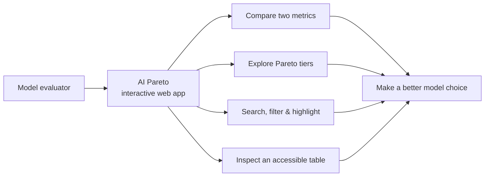
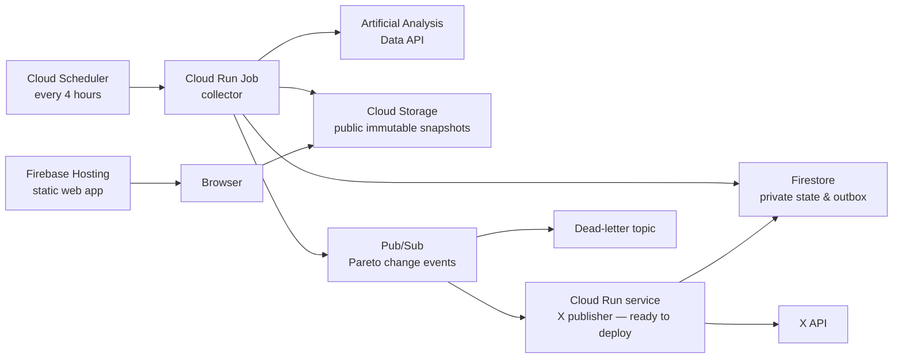
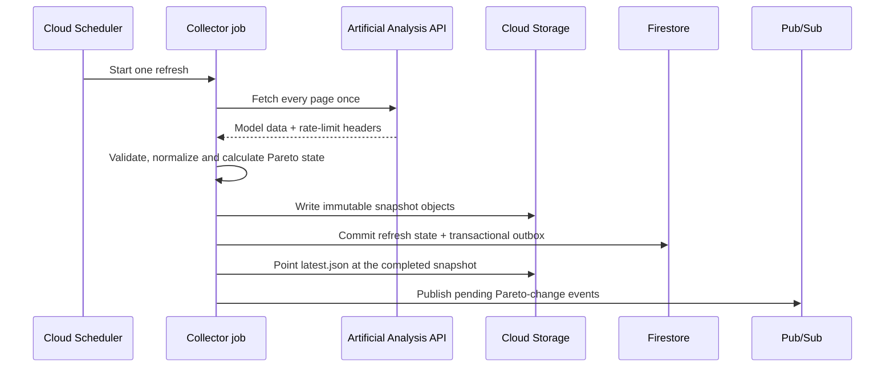
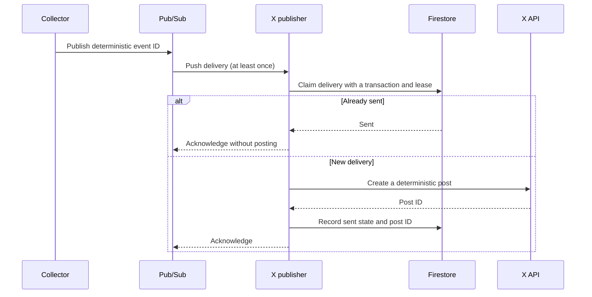

# AI Pareto

**Explore the trade-offs between the world's leading AI models.**

[**Open the live app**](https://ai-pareto.web.app) · [Architecture](doc/architecture.md) · [Local development](doc/local-development.md)

AI Pareto is an end-to-end, production-minded learning project that turns the [Artificial Analysis](https://artificialanalysis.ai) model dataset into an interactive Pareto frontier explorer. It answers a practical question: *which models are genuinely hard to beat when intelligence, cost, speed, and latency pull in different directions?*

Rather than presenting a single, misleading "best model" ranking, the app lets people explore the trade-offs and see the models that are non-dominated for the metrics that matter to them.

> The site is live and updated from a scheduled production collector every four hours. The X notification service is implemented and tested, and is ready to deploy once its production credentials are configured.

## What users can do

- Compare any two of intelligence, price per million tokens, cost per benchmark task, generation speed, and time to first token.
- See the first three Pareto fronts as gold, silver, and bronze tiers, with the thirty models closest to joining a front kept behind them as context.
- Search and highlight models or creators without making the frontier disappear; anything matched is drawn even when it falls outside that context set.
- Filter by creator or by individual model — each picker has its own search — and recompute the frontier for that subset, or hide visual tiers while preserving their original meaning.
- Switch to an accessible table view containing the same ranked model data as the chart.
- Open a shared `?highlight=` link directly on the model mentioned in a notification.

The interface is responsive by design: filters collapse first on small screens so the chart and table keep the available space, and chart labels are placed greedily to stay within the plot without overlapping one another.

## The product, at a glance



### Pareto tiers, not a winner-takes-all score

A model is on the first frontier when no other measured model is better on both selected axes. Remove that frontier and the next best set becomes the second frontier; repeat once more for bronze. This makes trade-offs visible instead of hiding them behind arbitrary metric weights.

For affordability, the project deliberately exposes two different measures:

| Metric | Meaning | Why it matters |
| --- | --- | --- |
| Price per 1M tokens | 3:1 blended input/output token rate | Useful for comparing model API rates; broader data coverage. |
| Cost per task | Actual spend for an Artificial Analysis Intelligence Index task | Captures output length as well as token rate; more honest for task-level cost. |

Missing values are excluded from the relevant axis. In particular, an upstream price of `$0` for an open-weight model without a hosted priced endpoint is treated as missing, so it cannot incorrectly dominate every cost comparison.

## Architecture

The production design separates public reads, scheduled ingestion, state, and external side effects. Static content does the everyday work; compute runs only when a refresh or an event needs it.



### Data refresh lifecycle



`latest.json` is updated only after the immutable snapshot has been written successfully. Browsers therefore read one coherent dataset, while older snapshots stay cacheable and can be retained independently.

### Event delivery and duplicate safety



Cloud delivery is intentionally treated as at-least-once. A transactional outbox prevents a refresh from losing its change event, Firestore leases prevent concurrent processing, and a recent-timeline reconciliation check narrows the remaining external-API failure window. The design does not make an unjustified "exactly once" claim where the X API cannot offer an idempotency key.

## Technology

| Area | Technology | How it is used |
| --- | --- | --- |
| Frontend | HTML, CSS, ES modules, SVG | Dependency-free responsive scatter plot, controls, tooltip, and table. |
| Local API | Node.js 22 standard library | Keeps the Artificial Analysis key server-side and serves the web app from the same origin. |
| Data pipeline | Node.js, Google Auth Library, Firestore, Pub/Sub | Normalizes paginated source data, creates snapshots, detects meaningful frontier movements, and publishes domain events. |
| Cloud platform | Google Cloud Run, Cloud Scheduler, Cloud Storage, Firestore, Pub/Sub, Secret Manager | Scale-to-zero workloads, scheduled refreshes, immutable public data, private state, messaging, and secrets. |
| Hosting | Firebase Hosting | CDN-backed static delivery of the frontend. |
| Infrastructure | Terraform, Cloud Build, Artifact Registry | Reproducible cloud resources and digest-pinned container deployments. |
| Notifications | X API with OAuth 1.0a User Context | A private Pub/Sub push consumer renders and publishes changes to the monitored frontier. |
| Testing | Node.js built-in test runner | Dependency-light unit and contract coverage across all three applications. |

## Engineering decisions worth exploring

| Decision | Reasoning |
| --- | --- |
| Keep credentials off the client | The upstream API key exists only in the local server or Secret Manager; the browser receives normalized public data, never a token. |
| Cache and batch upstream reads | The source endpoint is paginated and quota-limited. A refresh fetches each page once, caches locally during development, and refreshes in production every four hours. |
| Publish immutable snapshots | Static browsers never read partly written data. A small manifest points to a complete versioned snapshot. |
| Separate collection from notification | A problem delivering a social post cannot trigger extra upstream calls or prevent new data from being published. |
| Model delivery failures explicitly | Pub/Sub may retry. Deterministic event IDs, an outbox, Firestore transactions, and an eventual-consistency-aware reconciliation flow make those retries safe to handle. |
| Preserve meaning in the visual design | Medal colours have textual and table equivalents, labels use collision-aware placement, and filters distinguish between recomputing data and only changing what is drawn. |

## Repository guide

```text
apps/
  api/          Local development server and production Cloud Run collector
  web/          Static interactive frontend and Firebase Hosting configuration
  x-publisher/  Private Pub/Sub-to-X delivery service
infra/
  gcp/          Terraform for Google Cloud resources and IAM
doc/
  architecture.md       Detailed system design and failure semantics
  local-development.md  Setup notes, including restricted PowerShell environments
```

Each application owns its own package manifest, tests, and documentation. There is deliberately no root workspace or shared dependency tree.

## Run it locally

Requires Node.js 22 or later and an Artificial Analysis API key.

```bash
cp apps/api/config.properties.example apps/api/config.properties
cd apps/api
npm ci
npm start
```

Set `aa.api.key` in `apps/api/config.properties`, then open [http://localhost:8787](http://localhost:8787). The local server exposes `/api/*` and serves the frontend together.

If your PowerShell policy prevents the `npm` shim from running, use `npm.cmd` instead. The compact setup and troubleshooting guide is in [local development](doc/local-development.md).

## Further reading

- [Architecture and failure semantics](doc/architecture.md)
- [API and collector details](apps/api/README.md)
- [Frontend behaviour and accessibility decisions](apps/web/README.md)
- [X publisher delivery model](apps/x-publisher/README.md)
- [Google Cloud deployment notes](infra/gcp/README.md)

## Attribution

Model metrics are sourced from the [Artificial Analysis Data API](https://artificialanalysis.ai/data-api). AI Pareto is an independent project and is not affiliated with or endorsed by Artificial Analysis.

## License

No license has been selected yet. Until one is added, all rights are reserved.
