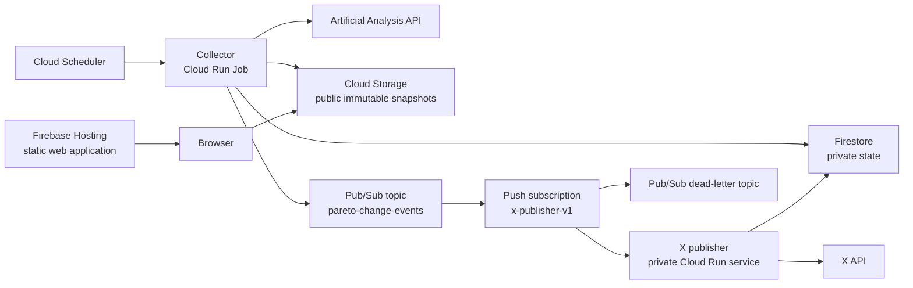

# Target Architecture

## Status

This document describes the target production architecture for Artificial Analyzer. It is the
baseline for the deployment work; the current local server remains the development entry point
until the migration is complete.

The system uses managed Google Cloud services and an event-driven notification path. The public
site and model snapshots are static. Compute runs only when data must be refreshed or a notification
must be delivered.

## Goals

- Keep the Artificial Analysis and X credentials out of the browser.
- Serve the frontend and published datasets as inexpensive static assets.
- Fetch the paginated upstream dataset once per refresh, never once per page render.
- Detect meaningful changes to Pareto fronts and publish them asynchronously.
- Isolate data refresh failures from notification delivery failures.
- Handle duplicate message delivery without duplicate side effects where the downstream API permits
  it.
- Keep the infrastructure small, observable, reproducible, and able to scale to zero.

## Non-goals

- Running a continuously active application server.
- Operating Kafka brokers or another self-managed message cluster.
- Providing real-time updates; freshness is bounded by the scheduled refresh interval.
- Guaranteeing distributed exactly-once execution across Google Cloud and the X API. That guarantee
  is impossible without downstream idempotency or reconciliation support.

## System overview



## Components

### Static web application

`apps/web` is deployed to Firebase Hosting. Firebase supplies HTTPS and CDN delivery. The frontend
contains no credentials and does not invoke Artificial Analysis directly.

At startup, the frontend fetches a small public manifest from Cloud Storage, then loads the immutable
model snapshot named by that manifest. This prevents a client from combining files from different
refreshes.

### Collector

The collector is a Cloud Run Job built from the backend code in `apps/api`. It has no public HTTP
endpoint. Cloud Scheduler starts one execution at each refresh interval.

One execution:

1. Reads the Artificial Analysis credential from Secret Manager.
2. Fetches every page of `GET /language/models/free` exactly once.
3. Validates and normalizes the response.
4. Computes the public dataset and the Pareto-front representation used for change detection.
5. Writes an immutable snapshot to Cloud Storage.
6. Compares the new canonical Pareto representation with the previous representation in Firestore.
7. In one Firestore transaction, records the refresh state and a pending outbox event when a
   meaningful change is found.
8. Atomically updates the small `latest.json` manifest after all snapshot files are available.
9. Publishes pending outbox events to Pub/Sub and marks them as enqueued.
10. Records the completed refresh and the last observed upstream rate-limit snapshot.

The Cloud Run container uses Application Default Credentials from its dedicated service account.
Firestore and Pub/Sub use their official Node.js clients. Cloud Storage uses its JSON API with the
official Google authentication client, create-only generation preconditions for immutable objects,
and a short-lived cache policy for `latest.json`.

A notification failure never causes the collector to refetch upstream data. Once an event is
accepted by Pub/Sub, notification delivery is a separate responsibility.

### Public snapshot storage

Cloud Storage replaces the production use of the local `.cache` directory. Only generated public
data is readable anonymously. Credentials, notification state, raw error bodies, and operational
metadata remain private.

The proposed object layout is:

```text
public/
  latest.json
  snapshots/
    <snapshot-id>/
      models.json
      pareto.json
```

Snapshot objects are immutable and cacheable for a long time. `latest.json` has a short cache
lifetime and is the final object updated during a successful refresh. A bucket lifecycle policy
removes old snapshots after the chosen retention period.

### Private state

Firestore stores small coordination records, not the complete public dataset. Expected records
include:

```text
refresh-state/current
pareto-state/<front-id>
outbox-events/<event-id>
notification-channels/x/deliveries/<event-id>
```

The transactional outbox closes the collector's dual-write gap: a refresh and its pending event are
recorded together before delivery is attempted. If publishing succeeds but marking the outbox entry
fails, the collector may publish the same domain event again. Its deterministic event ID makes that
safe for idempotent consumers.

`notification-channels/x/deliveries/<event-id>` contains the X delivery status, attempt metadata, an optional
lease, and the X post identifier after success. Firestore transactions prevent concurrent consumers
from claiming the same event at the same time.

### Event bus

The collector publishes domain events to the `pareto-change-events` Pub/Sub topic. The event states
that a fact occurred; it does not instruct a particular platform to publish a post. This keeps the
collector independent from X and permits future consumers such as an RSS projector or another
social-network publisher.

The first subscription is `x-publisher-v1`, an authenticated push subscription whose target is a
private Cloud Run service. Pub/Sub retries non-successful deliveries with exponential backoff.
Messages that repeatedly fail are forwarded to `pareto-change-events-dlq` for inspection and manual
replay.

Delivery is at least once. Duplicate delivery is an expected operating condition and must be covered
by tests.

### X publisher

The X publisher is a small Cloud Run service with zero minimum instances. It starts only when Pub/Sub
pushes an event. It validates the event schema, claims the event in Firestore, renders a deterministic
post, calls the X API, records the resulting post identifier, and acknowledges the message by
returning a successful HTTP status.

If the event is already recorded as sent, the service acknowledges it without calling X again. If
processing fails, it returns a non-successful status so Pub/Sub can retry.

The publisher uses OAuth 1.0a User Context and stores the API key, API secret, user access token, and
access-token secret as separate Secret Manager values. Every deterministic post includes a short
event marker. Before creating a post, the publisher checks the authenticated user's recent timeline
for that marker; finding it reconciles a previous accepted post whose Firestore update failed.

## Event contract

Events are small, versioned, and contain references rather than full model snapshots. A representative
payload is:

```json
{
  "schemaVersion": 1,
  "eventId": "sha256:8f76...",
  "type": "pareto.front.changed",
  "occurredAt": "2026-08-14T12:30:00Z",
  "fromSnapshot": "snapshot-abc",
  "toSnapshot": "snapshot-def",
  "frontId": "price-intelligence",
  "addedModelIds": ["model-a"],
  "removedModelIds": ["model-b"]
}
```

`eventId` is derived deterministically from the event type, front identifier, and canonical before
and after states. Repeating the same refresh therefore produces the same event identity.

The initial monitored objective sets are `cost-per-task-intelligence` and `price-intelligence`,
covering the two affordability metrics exposed by the web application. The snapshot stores up to
four tiers for each objective set, while change events describe only membership changes in the
outermost non-dominated front. The first successful snapshot establishes the baseline and does not
emit a change event.

Breaking event changes require a new `schemaVersion`. Consumers must reject unsupported versions so
that incompatible messages reach the dead-letter path instead of being misinterpreted.

## Delivery semantics and idempotency

The push subscription uses at-least-once delivery. The consumer follows this sequence:

1. Validate the envelope and event schema.
2. Read `notification-deliveries/x/<event-id>`.
3. Return success immediately when its status is `sent`.
4. Acquire or renew a time-limited processing lease in a Firestore transaction.
5. Publish the deterministic post.
6. Persist `sent`, the X post identifier, and completion time.
7. Return success to acknowledge the Pub/Sub message.

There is an unavoidable failure window if X accepts a post and the publisher stops before recording
the post identifier. The implementation should use a downstream idempotency key if X supports one.
Otherwise it must reconcile against recent posts using a stable marker, or explicitly choose between
possible duplicates and possible missed notifications. This trade-off must not be hidden behind an
"exactly once" claim.

## Scheduling and upstream quota

One complete upstream refresh currently requires four requests. An hourly schedule would consume 96
of the 100 requests available in a fixed 24-hour window and leave too little retry capacity. The
initial production interval is therefore every four hours. This uses six complete refreshes (24
requests) in a 24-hour window and leaves substantial capacity for failures and manual executions.

The collector uses the upstream rate-limit headers to avoid starting a refresh that cannot complete.
Retries must resume or abandon the current refresh without silently performing a second complete
fetch.

## Security and access control

- Artificial Analysis and X credentials are separate Secret Manager secrets.
- The collector service account can read the Artificial Analysis secret, write snapshot objects,
  update its Firestore records, and publish only to the Pareto-change topic.
- The publisher service account can read the X secrets and update notification records. It cannot
  fetch the upstream dataset or replace public snapshots.
- A dedicated Pub/Sub push identity has permission to invoke only the private publisher service.
- Firebase Hosting and the public Cloud Storage objects contain no operational state or credentials.
- The public bucket is dedicated to generated public data; private objects are kept in other
  resources rather than mixed into that bucket.
- Logs contain identifiers and summaries, never credentials or complete upstream response bodies.

## Failure handling

| Failure | Expected behavior |
| --- | --- |
| Upstream request fails | Keep the last manifest unchanged and record a failed refresh. |
| Snapshot upload fails | Do not update `latest.json` and do not publish an event. |
| Firestore comparison or transaction fails | Leave the new snapshot unreferenced and retry without refetching if possible. |
| Manifest update fails | Keep the outbox event pending and recover from the stored snapshot. |
| Pub/Sub publish fails | Keep the outbox event pending and retry the same event ID without refetching. |
| X is unavailable | Return an error so Pub/Sub retries with backoff. |
| Event is permanently invalid | Forward it to the dead-letter topic after the configured attempts. |
| Duplicate event arrives | Detect the stored event ID and acknowledge without another X call. |

## Observability

Structured Cloud Logging entries include `refreshId`, `snapshotId`, `eventId`, `frontId`, and
`deliveryAttempt` where applicable. Monitoring should alert on:

- consecutive collector failures;
- the age of the oldest unacknowledged notification;
- any message reaching the dead-letter subscription;
- unexpected upstream quota exhaustion;
- a non-zero publisher error rate.

The dead-letter subscription is retained for manual inspection and replay. It must not be treated as
an archival event store.

## Deployment and infrastructure

Cloud Build builds container images for the collector and publisher. Artifact Registry stores a small
number of recent images; a cleanup policy removes superseded versions. Cloud Run deployments use
immutable image digests.

Infrastructure configuration should be reproducible and kept separate from the application packages.
It must define the service accounts, least-privilege IAM bindings, storage bucket and lifecycle rule,
Firestore database, Pub/Sub topics and subscriptions, dead-letter policy, Cloud Run workloads, Cloud
Scheduler job, and budget alerts.

Terraform under `infra/gcp` is the source of truth for Google Cloud resources. Its first apply creates
bootstrap infrastructure without requiring a container image; after Cloud Build pushes the collector,
a second apply receives an Artifact Registry digest and creates the Cloud Run Job and Scheduler. The
default region and Firestore location are `europe-west1`, immutable snapshots are retained for 30
days, and the collector runs at minute 17 every four hours in UTC. These values remain configurable,
but changing the Firestore location after database creation is not supported.

Terraform creates the Secret Manager containers but never receives secret values. A separate local
script streams the ignored Artificial Analysis key directly to `gcloud`, preventing credentials from
entering Terraform plans or state. Collector images are digest-pinned, and the job runs one task with
two Cloud Run retries.

The same bootstrap apply creates empty X credential secret containers. The publisher service and its
push subscription remain absent until both a digest-pinned publisher image and numeric X user ID are
provided. Enabling them creates the private scale-to-zero service, authenticated Pub/Sub push,
ten-attempt dead-letter policy, a retained pull subscription for failed events, and the IAM bindings
required by the Pub/Sub service agent.

Production deployment requires a billing-enabled Google Cloud project even when usage remains within
the free tiers. Budget alerts and available service-level spending caps are safety controls, not a
replacement for quotas and least-privilege configuration.

## Cost characteristics

There are no intentionally always-on compute resources:

- Firebase Hosting and Cloud Storage are billed by storage and transfer.
- Cloud Run is billed only while the collector or publisher is running.
- Cloud Scheduler has one configured schedule.
- Firestore is billed by operations, storage, and transfer.
- Pub/Sub is billed by message throughput and retention.
- Secret Manager is billed by active secret versions and accesses.
- Cloud Build, Artifact Registry, and Cloud Logging are usage-based deployment and operations costs.

At the expected traffic and event volume, the system is designed to remain within the relevant free
allowances or incur only negligible usage charges. No correctness assumption depends on a promotional
credit remaining available.

## Alternatives considered

### Apache Kafka

Kafka would provide a durable partitioned event log and consumer groups, but operating or paying for
a Kafka cluster is not justified by this system's message volume or retention requirements. Pub/Sub
provides the delivery semantics and fan-out required here without broker operations.

### Cloud Tasks

Cloud Tasks would be the simpler choice for a command addressed to one HTTP worker, such as "publish
this post." Pub/Sub is selected because `pareto.front.changed` is a domain event that can reasonably
have independent consumers. The collector should not know which notification channels exist.

### Synchronous notification

Calling X from the collector would use fewer cloud components, but it would couple data freshness to
an unrelated external API and could cause notification retries to consume upstream API quota. The
asynchronous boundary prevents that failure propagation.

## Local development

The existing local server continues to serve `apps/web` and use the file cache for development. Cloud
adapters must sit behind small interfaces so core normalization, Pareto comparison, event creation,
and post rendering can be tested without live Google Cloud services.

Tests should cover canonical event generation, duplicate delivery, lease expiry, retryable and
permanent X failures, unsupported schema versions, snapshot publication ordering, and dead-letter
eligibility.
